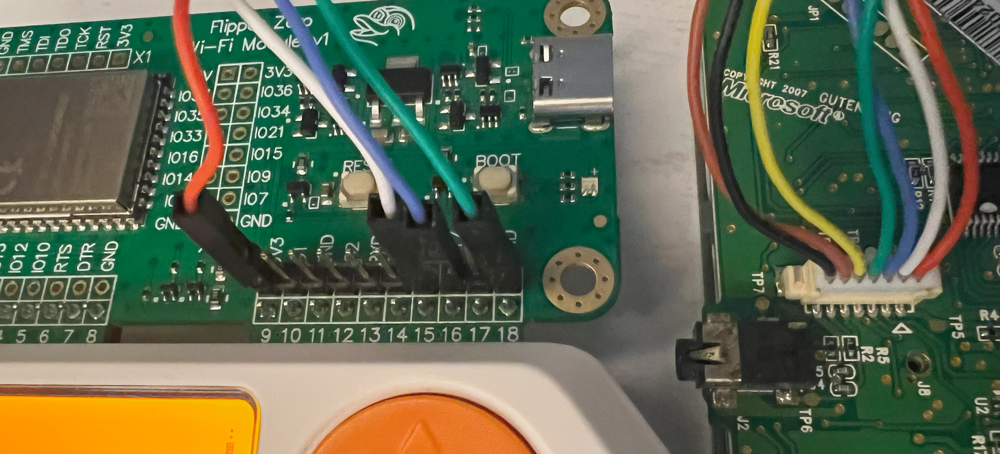

# flipper-zero-input
Alternative input for the Flipper Zero


## Introduction

This project aims to provide an alternative input method for the Flipper Zero. The Flipper Zero is a multi-tool device that can be used for a variety of tasks, such as hacking, pentesting, and hardware hacking. However, the default input method for the Flipper Zero is limited to using the D-Pad for input. This often results in people typing short names for their files, like `liv.sub` instead of a descriptive name like `living room light.sub`.  This project aims to expand the input capabilities of the Flipper Zero by adding support for external input devices, such as the Chatpad and Mobile phone input devices.

- Installing firmware with Chatpad and Mobile input support
  
   - [Quick Installation](#quick-installation)

      **OR**
   - [Firmware Overlay Installation](#firmware-overlay-installation)

- Bluetooth Phone
  - [Bluetooth Setup](#bluetooth-setup)

- Chatpad
  - [Chatpad Hardware](#chatpad-hardware)
  - [Chatpad Setup](#chatpad-setup)


## Firmware Quick Installation

The following steps will allow you to quickly test the Chatpad and Mobile input features on **your** Flipper Zero. However, these prebuilt versions of the firmware may not be the latest version available. If you would like to install the latest version of the firmware, please follow the instructions in the [Firmware Overlay Installation](#firmware-overlay-installation) section below.

1. Download the prebuilt package for your Flipper Zero (NOTE: these firmware packages are modified versions of the official that include Chatpad and Mobile input support)

    - [Official firmware v1.1.2 - modified with Chatpad and Mobile input support](https://github.com/jamisonderek/flipper-zero-input/blob/main/prebuilt/flipper-official-1.1.2.tgz)
    - [Momentum firmware v008 - modified with Chatpad and Mobile input support](https://github.com/jamisonderek/flipper-zero-input/blob/main/prebuilt/flipper-mntm-008.tgz)
    - [Unleashed firmware v079 - modified with Chatpad and Mobile input support](https://github.com/jamisonderek/flipper-zero-input/blob/main/prebuilt/flipper-unlshd-079.tgz)
    - [RogueMaster firmware - modified with Chatpad and Mobile input support](#)

2. Install the firmware package on your Flipper Zero

    - Connect your Flipper Zero to your computer via USB
    - Open qFlipper
    - Click on the "Install from File" link (bottom right corner)
    - Select the downloaded firmware package from step 1
    - Click "Open" and then "Install"

3. Your Flipper Zero will be updated with the new firmware.

## Bluetooth Setup

The easiest way to input text on the Flipper Zero is to use a Bluetooth on your phone. This requires that you are running the [Flipper Zero mobile app](https://docs.flipper.net/mobile-app) and have paired it with your Flipper Zero. 

NOTE: if you switched firmware the pairing may be lost, so you may need to forget the device and add it again.

Once you have the mobile app working, the following steps will send text to the text input to the Flipper Zero.
1. Open the mobile app and connect to your Flipper Zero.
2. Click on the "Options" button (it's on the first tab).
3. Click on the "File Manager" button.
4. You should be on the SD card folder (if not, click on the `/ext` folder).
5. If this is your first time using the app:

   - Click on the "+" button in the top right.
   - Then click on the "New File" button.
   - Then name the file `input-line.txt`

6. Open the "input-line.txt" file
7. Type a line of text you would like to send to the Flipper Zero.
8. On your Flipper make sure you are in the text input screen.
9. Click on the "Save" (or checkmark) button in the top right.
10. The text will be sent to the Flipper Zero and you should see it in the text input!
   
   - On iOS you will still be in the "input-line.txt" file, so you can edit the text and click "Save" again to send the new text to the Flipper Zero.
   - On Android you will need to click on the "input-line.txt" file again, choose "Edit", and then click "Save" to send the new text to the Flipper Zero.

In the future, it would be great to have a more seamless integration with the Flipper Zero mobile app. You can find the existing apps here:
   - [https://github.com/flipperdevices/Flipper-Android-App](https://github.com/flipperdevices/Flipper-Android-App)
   - [https://github.com/flipperdevices/Flipper-iOS-App](https://github.com/flipperdevices/Flipper-Android-App)

## Chatpad Hardware



The Xbox 360 Chatpad is a small keyboard that was originally designed for the Xbox 360. You can still find them on eBay for around $15USD. The model I used was **X814365-001**, which is a wired keypad.

To take it apart you will need:
   - T6 screwdriver
   - A small phillips screwdriver
   - Something to pry the case apart (I used a small fork)

I ordered a separate 7-pin, 1.25mm to Dupont 2.54mm adapter from Amazon. This allows me to connect the Chatpad to the Flipper Zero. You could also cut the existing cable and solder the wires to the Flipper Zero, but I wanted to keep the Chatpad intact. The adapter I used was the following:
   - [7-pin, 1.25mm to Dupont 2.54mm adapter](https://www.amazon.com/gp/product/B07PWZTC88)

To take the Chatpad apart, follow these steps:
   - Remove the four T6 screws on the back of the Chatpad.
   - Carefully pry the case apart.
   - Remove the ribbon cable from the PCB.
   - Remove the 5 tiny phillips screws holding the PCB in place.
   - Carefully remove the PCB from the case.

Connect the adapter to the Chatpad PCB:
   - Connect the 7-pin, 1.25mm connector to the Chatpad PCB.
   - Connect the Dupont 2.54mm connector to the Flipper Zero.
   - Pin 1 on the Chatpad has a little triangle on the PCB.
   - Connect Pin 1 on the Chatpad to Pin 9 `3V3` on the Flipper Zero.
   - Connect Pin 2 on the Chatpad to Pin 15 `C1` on the Flipper Zero.
   - Connect Pin 3 on the Chatpad to Pin 16 `C2` on the Flipper Zero.
   - Connect Pin 4 on the Chatpad to Pin 18 `GND` on the Flipper Zero.
   - Pins 5, 6, and 7 on the Chatpad are not used (they are for audio).

## Chatpad Setup

Once you have installed the firmware using the [Quick Installation](#quick-installation) or [Firmware Overlay Installation](#firmware-overlay-installation) steps, you can connect the Chatpad to the Flipper Zero. Every time you restart the Flipper Zero you will need to reconnect the Chatpad.

1. Connect the Chatpad to the Flipper Zero (Flipper GPIO pins 9, 15, 16, 18 -- see [Chatpad Hardware](#chatpad-hardware) for more details).
2. Turn on the Flipper Zero.
3. Click "OK" and then select the "Settings" option.
4. Select the "Chatpad" option.
5. Click on the "Chatpad" menu item. Click "OK" to turn on the chatpad.
6. You should see "Chatpad is ON" and then "Chatpad is READY".
7. Press a key on the Chatpad and you should see the key pressed on the Flipper Zero screen.

You can set Macros in the Chatpad Config.

1. Choose "Config" from the Chatpad menu.
2. For the "Macro" option, choose the letter you would like to assign a macro to.
3. Click "OK" and then type the text you would like to assign to the macro. (You can use the Chatpad to type the text.)
4. Cick "Save"
5. To use the macro, hold the "People" key (next to the green button on the chatpad) and then press the letter you assigned the macro to.

## Firmware Overlay Installation

The following steps will guide you through the process of installing the latest version of the firmware on your Flipper Zero. This process requires you to build the firmware from source. If you would like to install a prebuilt version of the firmware, please follow the instructions in the [Quick Installation](#quick-installation) section above.

The following directions are for Windows users using a command prompt. If you are using a different operating system or using PowerShell, you will need to adjust the commands accordingly.

Install prerequisites before proceeding:

   - Install [git](https://git-scm.com/downloads)
   - Install [vscode](https://code.visualstudio.com/download)
   - NOTE: I have a YouTube video on setting up a [Windows development environment](https://youtu.be/gqovwRkn2xw) or [Ubuntu environment](https://youtu.be/PaqK1H9brZQ).

Directions:

1. Open a command prompt and navigate to the directory where you would like to store the firmware and input files.

    ```bash
    mkdir \repos
    cd \repos
    ```

2. Clone the repository for the firmware you would like to run on your Flipper Zero. The following repositories are available:

    Official firmware:

    ```bash
    git clone --recursive https://github.com/flipperdevices/flipperzero-firmware.git flipperzero-firmware
    ```

    Momentum firmware:

    ```bash
    git clone --recursive https://github.com/Next-Flip/Momentum-Firmware.git flipperzero-firmware
    ```

    Unleashed firmware:

    ```bash
    git clone --recursive https://github.com/DarkFlippers/unleashed-firmware.git flipperzero-firmware
    ```

    RogueMaster firmware:

    ```bash
    git clone --recursive https://github.com/RogueMaster/flipperzero-firmware-wPlugins.git flipperzero-firmware
    ```

3. Clone this repository

    ```bash
    git clone https://github.com/jamisonderek/flipper-zero-input.git
    ```

4. You should have now two directories: `flipperzero-firmware` and `flipper-zero-input`

    ```
    dir
    ```
   
5. In the `flipper-zero-input` directory there is a `firmware-overlay` directory, which contains folders based on various firmware (like `ofw-1.1.2`).

    ```
    start .
    ```

6. WARNING: The firmware-overlays contains updated `text_input.c`, `rpc.c`, `rpc_storage.c` and `settings/applications.fam` files which were part of the original firmware. If these files have been updated in the firmware you are using, you will need to manually merge the changes. It is recommend you first sync to the version of the firmware used by the overlay before applying the overlay. In a later step you can advance to the latest version of the firmware.

    Official firmware:

    ```bash
    cd flipperzero-firmware
    git pull
    git checkout "1.1.2"
    ```

    Momentum firmware:
    
    ```bash
    cd flipperzero-firmware
    git pull
    git checkout "mntm-008"
    ```

    Unleashed firmware:
    
    ```bash
    cd flipperzero-firmware
    git pull
    git checkout "unlshd-079"
    ```

    RogueMaster firmware:
    
    ```bash
    cd flipperzero-firmware
    git pull
    git checkout "RM1202-0837-0.420.0-6d10bad"
    ```

7. Copy the application folder in `firmware-overlay` directory over the application folder in `flipperzero-firmware` directory

    Official firmware:

    ```bash
    cd applications
    xcopy ..\..\flipper-zero-input\firmware-overlay\ofw-1.1.2\applications\*.* . /e /y
    cd ..
    ```

    Momentum firmware:

    ```bash
    cd applications
    xcopy ..\..\flipper-zero-input\firmware-overlay\mntm-008\applications\*.* . /e /y
    cd ..
    ```

    Unleashed firmware:

    ```bash
    cd applications
    xcopy ..\..\flipper-zero-input\firmware-overlay\unlshd-079\applications\*.* . /e /y
    cd ..
    ```

    RogueMaster firmware:

    ```bash
    cd applications
    xcopy ..\..\flipper-zero-input\firmware-overlay\rm1202-0837-0.420.0-6d10bad\applications\*.* . /e /y
    cd ..
    ```

8. Connect your Flipper Zero to your computer and build & deploy the firmware

    ```bash
    fbt vscode_dist
    fbt COMPACT=1 DEBUG=0 FORCE=1 flash_usb_full 
    ```

9. Apply the changes to the latest firmware

    First choose the branch or tag of the firmware you would like to use. The following branches and tags are available:

    Official firmware:
    - `dev`
    - `release`
    - [tags](https://github.com/flipperdevices/flipperzero-firmware/tags), like `1.1.2`
    
    Momentum firmware:

    - `dev`
    - `release`
    - [tags](https://github.com/Next-Flip/Momentum-Firmware/tags), like `mntm-008`

    Unleashed firmware:
    - `dev`
    - `release`
    - [tags](https://github.com/DarkFlippers/unleashed-firmware/tags), like `unlshd-079`

    RogueMaster firmware:
    - `420`
    - [tags](https://github.com/RogueMaster/flipperzero-firmware-wPlugins/tags), like `RM1202-0837-0.420.0-6d10bad`

    The run the following command (replace "dev" with the branch or tag you would like to use):

    ```bash
    git stash push -u
    git checkout "dev"
    git stash pop
    ```

10. Connect your Flipper Zero to your computer and build & deploy the firmware

    ```bash
    fbt COMPACT=1 DEBUG=0 FORCE=1 flash_usb_full 
    ```
