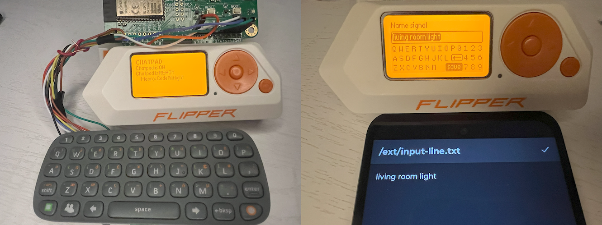

# flipper-zero-input
Alternative input for the Flipper Zero




## Introduction

This project aims to provide an alternative input method for the Flipper Zero. The Flipper Zero is a multi-tool device that can be used for a variety of tasks, such as hacking, pentesting, and hardware hacking. However, the default input method for the Flipper Zero is limited to using the D-Pad for input. This often results in people typing short names for their files, like `liv.sub` instead of a descriptive name like `living room light.sub`.  This project aims to expand the input capabilities of the Flipper Zero by adding support for external input devices, such as the Chatpad and Mobile phone input devices.

## Quick Installation

The following steps will allow you to quickly test the Chatpad and Mobile input features on **your** Flipper Zero. However, these prebuilt versions of the firmware may not be the latest version available. If you would like to install the latest version of the firmware, please follow the instructions in the [Overlay Installation](#overlay-installation) section below.

1. Download the prebuilt package for your Flipper Zero (NOTE: these firmware packages are modified versions of the official that include Chatpad and Mobile input support)

    - [Official firmware v1.1.2 - modified with Chatpad and Mobile input support](https://github.com/jamisonderek/flipper-zero-input/blob/main/prebuilt/flipper-official-1.1.2.tgz)
    - [Momentum firmware v008 - modified with Chatpad and Mobile input support](https://github.com/jamisonderek/flipper-zero-input/blob/main/prebuilt/flipper-mntm-008.tgz)
    - [Unleashed firmware v079 - modified with Chatpad and Mobile input support](https://github.com/jamisonderek/flipper-zero-input/blob/main/prebuilt/flipper-unlshd-079.tgz)
    - [RogueMaster firmware - modified with Chatpad and Mobile input support](#)

2. Install the firmware package on your Flipper Zero

    - Connect your Flipper Zero to your computer via USB
    - Open qFlipper
    - Click on the "Install from File" link (bottom right corner)
    - Select the downloaded firmware package from step 1
    - Click "Open" and then "Install"

3. Your Flipper Zero will be updated with the new firmware.


## Overlay Installation

The following steps will guide you through the process of installing the latest version of the firmware on your Flipper Zero. This process requires you to build the firmware from source. If you would like to install a prebuilt version of the firmware, please follow the instructions in the [Quick Installation](#quick-installation) section above.

The following directions are for Windows users using a command prompt. If you are using a different operating system or using PowerShell, you will need to adjust the commands accordingly.

Install prerequisites before proceeding:

   - Install [git](https://git-scm.com/downloads)
   - Install [vscode](https://code.visualstudio.com/download)
   - NOTE: I have a YouTube video on setting up a [Windows development environment](https://youtu.be/gqovwRkn2xw) or [Ubuntu environment](https://youtu.be/PaqK1H9brZQ).

Directions:

1. Open a command prompt and navigate to the directory where you would like to store the firmware and input files.

    ```bash
    mkdir \repos
    cd \repos
    ```

2. Clone the repository for the firmware you would like to run on your Flipper Zero. The following repositories are available:

    Official firmware:

    ```bash
    git clone --recursive https://github.com/flipperdevices/flipperzero-firmware.git flipperzero-firmware
    ```

    Momentum firmware:

    ```bash
    git clone --recursive https://github.com/Next-Flip/Momentum-Firmware.git flipperzero-firmware
    ```

    Unleashed firmware:

    ```bash
    git clone --recursive https://github.com/DarkFlippers/unleashed-firmware.git flipperzero-firmware
    ```

    RogueMaster firmware:

    ```bash
    git clone --recursive https://github.com/RogueMaster/flipperzero-firmware-wPlugins.git flipperzero-firmware
    ```

3. Clone this repository

    ```bash
    git clone https://github.com/jamisonderek/flipper-zero-input.git
    ```

4. You should have now two directories: `flipperzero-firmware` and `flipper-zero-input`

    ```
    dir
    ```
   
5. In the `flipper-zero-input` directory there is a `firmware-overlay` directory, which contains folders based on various firmware (like `ofw-1.1.2`).

    ```
    start .
    ```

6. WARNING: The firmware-overlays contains updated `text_input.c`, `rpc.c`, `rpc_storage.c` and `settings/applications.fam` files which were part of the original firmware. If these files have been updated in the firmware you are using, you will need to manually merge the changes. It is recommend you first sync to the version of the firmware used by the overlay before applying the overlay. In a later step you can advance to the latest version of the firmware.

    Official firmware:

    ```bash
    cd flipperzero-firmware
    git pull
    git checkout "1.1.2"
    ```

    Momentum firmware:
    
    ```bash
    cd flipperzero-firmware
    git pull
    git checkout "mntm-008"
    ```

    Unleashed firmware:
    
    ```bash
    cd flipperzero-firmware
    git pull
    git checkout "unlshd-079"
    ```

    RogueMaster firmware:
    
    ```bash
    cd flipperzero-firmware
    git pull
    git checkout "RM1202-0837-0.420.0-6d10bad"
    ```

7. Copy the application folder in `firmware-overlay` directory over the application folder in `flipperzero-firmware` directory

    Official firmware:

    ```bash
    cd applications
    xcopy ..\..\flipper-zero-input\firmware-overlay\ofw-1.1.2\applications\*.* . /e /y
    cd ..
    ```

    Momentum firmware:

    ```bash
    cd applications
    xcopy ..\..\flipper-zero-input\firmware-overlay\mntm-008\applications\*.* . /e /y
    cd ..
    ```

    Unleashed firmware:

    ```bash
    cd applications
    xcopy ..\..\flipper-zero-input\firmware-overlay\unlshd-079\applications\*.* . /e /y
    cd ..
    ```

    RogueMaster firmware:

    ```bash
    cd applications
    xcopy ..\..\flipper-zero-input\firmware-overlay\rm1202-0837-0.420.0-6d10bad\applications\*.* . /e /y
    cd ..
    ```

8. Connect your Flipper Zero to your computer and build & deploy the firmware

    ```bash
    fbt vscode_dist
    fbt COMPACT=1 DEBUG=0 FORCE=1 flash_usb_full 
    ```

9. Apply the changes to the latest firmware

    First choose the branch or tag of the firmware you would like to use. The following branches and tags are available:

    Official firmware:
    - `dev`
    - `release`
    - [tags](https://github.com/flipperdevices/flipperzero-firmware/tags), like `1.1.2`
    
    Momentum firmware:

    - `dev`
    - `release`
    - [tags](https://github.com/Next-Flip/Momentum-Firmware/tags), like `mntm-008`

    Unleashed firmware:
    - `dev`
    - `release`
    - [tags](https://github.com/DarkFlippers/unleashed-firmware/tags), like `unlshd-079`

    RogueMaster firmware:
    - `420`
    - [tags](https://github.com/RogueMaster/flipperzero-firmware-wPlugins/tags), like `RM1202-0837-0.420.0-6d10bad`

    The run the following command (replace "dev" with the branch or tag you would like to use):

    ```bash
    git stash push -u
    git checkout "dev"
    git stash pop
    ```

10. Connect your Flipper Zero to your computer and build & deploy the firmware

    ```bash
    fbt COMPACT=1 DEBUG=0 FORCE=1 flash_usb_full 
    ```
